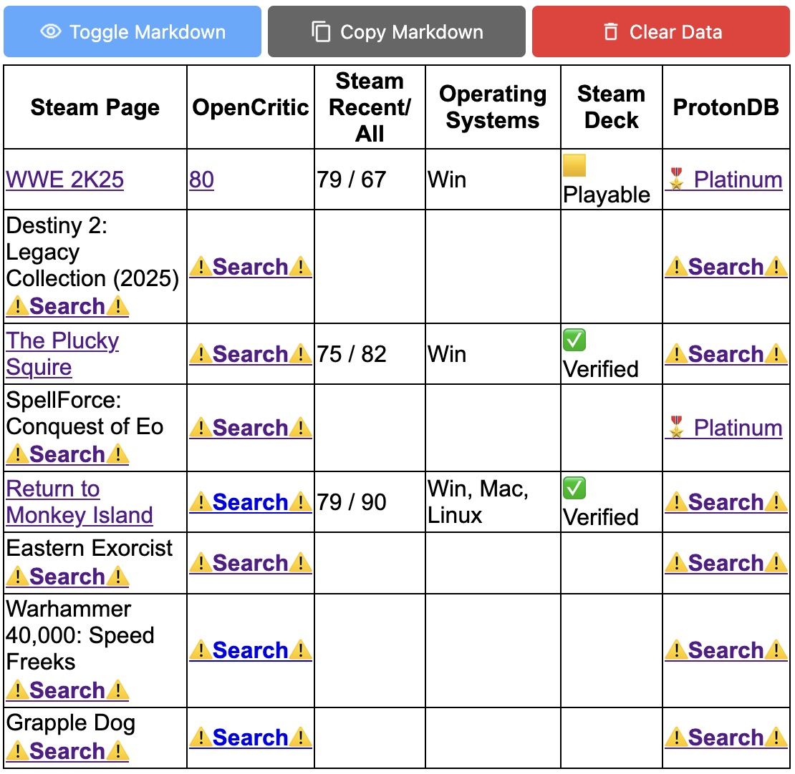
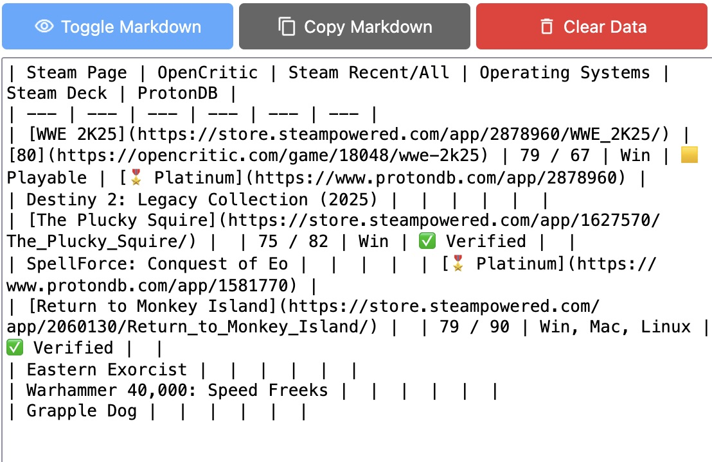

# Info Table for Humble Choice

A browser extension designed to gather and organize information on monthly Humble Choice games. It parses data from Humble, Steam, OpenCritic, and ProtonDB to create a structured markdown table, based on the layouts posted to [Tildes.net](https://tildes.net) by user [kfwyre](https://tildes.net/user/kfwyre). Hopefully makes life easier for users posting the Tildes Humble Choice topics.

## Features

- **Cross-browser support**: Works on **Firefox** (primary target) and **Chrome**.
- **Data aggregation**: Reads information from Humble, Steam, OpenCritic, and ProtonDB.
- **Markdown table generation**: Uses the layout format from Tildes posts by [kfwyre](https://tildes.net/user/kfwyre).
- **Minimal user interaction**: Navigate to game pages on supported websites, and the extension does the rest.
- **Private**: Does not collect or transmit any user data. All game data is stored in the browser only.

## Installation

Alternatively, get the signed .xpi file from [Releases](https://github.com/talklittle/humble-choice-info-table/releases).

## Usage

1. **Open the extension** from the browser toolbar icon.
2. **Navigate to the Humble Choice membership page** at [https://www.humblebundle.com/membership](https://www.humblebundle.com/membership).
3. **Navigate to each game's page** on Steam, OpenCritic, and ProtonDB. This extension generates search links for easier access.
4. **The extension automatically parses and stores the game info**, viewable via the icon in the browser toolbar.
5. **View and copy the markdown table** using the extension's popup window by clicking the extension's icon.
6. **Disable the extension** when you're done. It's not really useful to keep running after the table is complete.

> [!NOTE]
> You must manually visit each game's page for the extension to gather data. It does not automatically fetch information from external sources.

## Screenshots

### Partially filled table:

### Generated markdown:

## Release Notes

See [CHANGELOG.md](CHANGELOG.md).

## Known Issues

1. **DLC bundles not handled**: The extension does not automatically parse or handle DLC bundles. Manual data entry is required for these cases.
2. **Chrome dark theme icon**: On Chrome, the extension icon does not automatically update to match dark/light themes until the user manually clicks the extension icon.

## License

This project is licensed under the [Mozilla Public License 2.0](LICENSE.txt).
